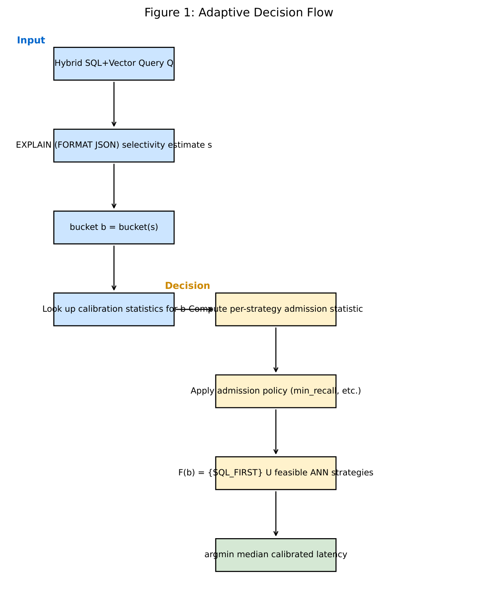
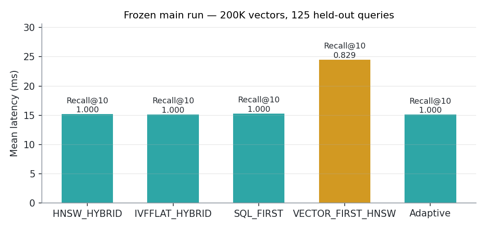
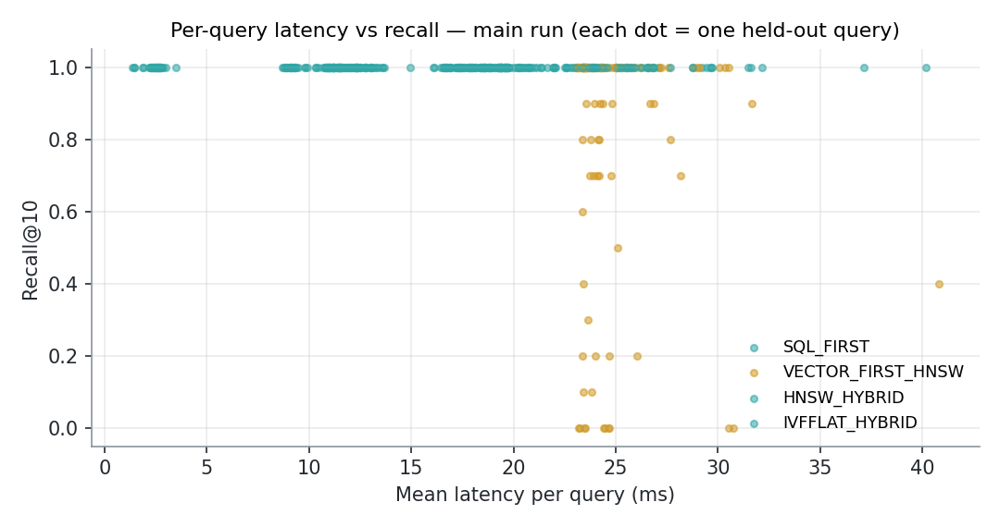
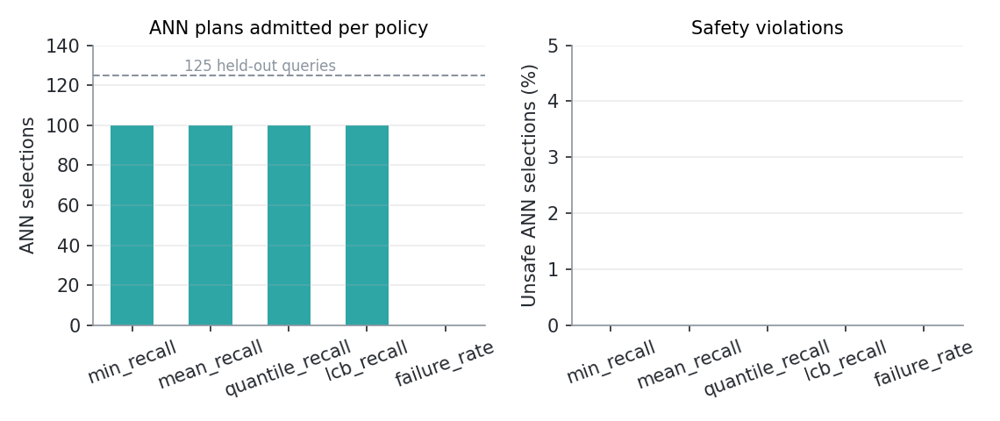
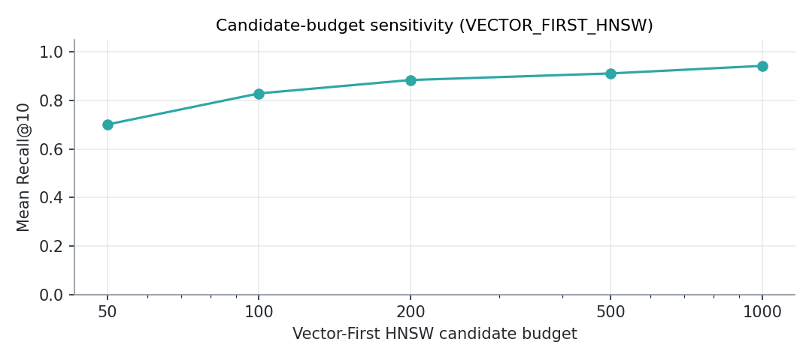
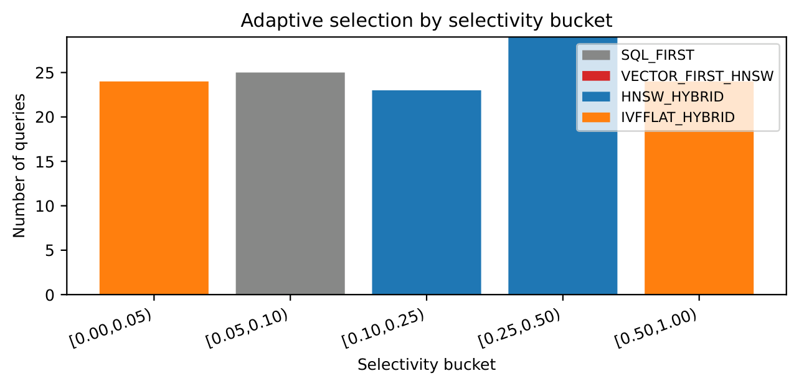
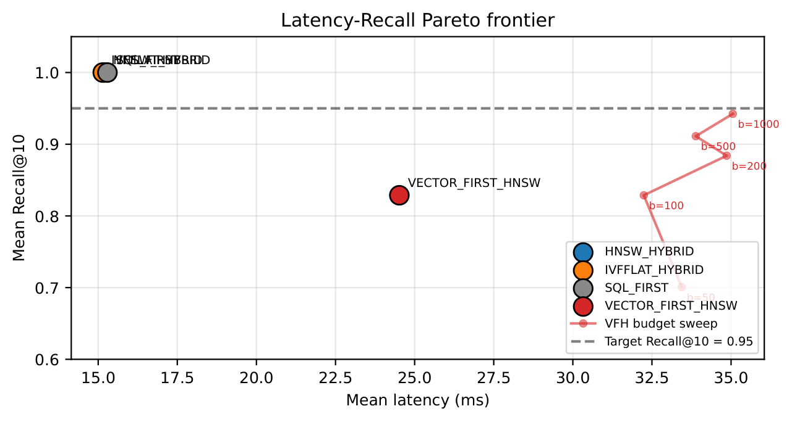

<div align="center">

# SDAO — Selectivity-Driven Adaptive Strategy Selection for Hybrid SQL–Vector Databases

**Full experiment suite, frozen research artifacts, and development history**

*A recall-aware admission layer that decides when an ANN index plan is safe to run — and when it silently returns wrong answers.*

[📄 Paper (IEEE)](final/paper/ieee/main.pdf) ·
[🧊 Frozen Configuration](final/frozen_configuration.yaml) ·
[🧪 Verification Guide](REPRODUCE.md) ·
[📊 Result Tables](final/results/tables/main_summary.csv) ·
[🗂 Submission Artifacts](https://github.com/abhijeet1267/pgvector-hybrid-ann-pac)




</div>

---

This repository is the **complete working suite** behind the SDAO research line: the
config-driven experiment framework, the frozen main run on a 200 000-vector SIFT1M
subset, the 1M-row PAC validation artifacts, the LaTeX sources for both manuscripts,
and the full development history — including the honest experiment log that documents
what changed and why.

> **Looking for the submission bundle?** The camera-ready manuscripts, anonymized
> PDFs, and verification scripts live in the companion repository
> [`pgvector-hybrid-ann-pac`](https://github.com/abhijeet1267/pgvector-hybrid-ann-pac)
> (*"Recall-Constrained Admission for Hybrid ANN-SQL Plans: PAC Bounds, q-Error
> Resilience, and 1M-Row Validation"*). This repo is where the experiments actually
> live.

## The Research Problem

Hybrid vector-relational queries combine a filtering SQL predicate
(`WHERE price < 100`) with top-*k* nearest-neighbour search over 128-D embeddings in
PostgreSQL + pgvector. The planner must lead with either:

- **Exact relational scan (`SQL_FIRST`)** — guaranteed 100% recall, high latency at scale
- **Approximate index scan (`HNSW_HYBRID`)** — fast, but under restrictive selectivity
  its recall can **collapse to 0.048–0.216 at 1M rows**: wrong top-*k* answers, silently

A latency-driven planner always prefers the ANN path. SDAO treats plan choice as a
**recall-constrained admission problem**: each candidate plan carries a calibrated
per-(strategy, selectivity-bucket) recall bound, and a planner hook admits a plan
only if its bound clears the query's recall target.

## ✅ Verified Results — Frozen Main Run (200K vectors, 125 held-out queries)

Every number below is read directly from a checked-in artifact; the frozen
configuration is [`final/frozen_configuration.yaml`](final/frozen_configuration.yaml).

| Result | Value | Source artifact |
|---|---|---|
| SQL_FIRST | 15.29 ms mean, Recall@10 = 1.000 | `final/results/tables/main_summary.csv` |
| IVFFLAT_HYBRID | 15.14 ms mean, Recall@10 = 1.000 | `final/results/tables/main_summary.csv` |
| HNSW_HYBRID | 15.20 ms mean, Recall@10 = 1.000 | `final/results/tables/main_summary.csv` |
| VECTOR_FIRST_HNSW | 24.52 ms mean, **mean Recall@10 = 0.829, min = 0.0** | `final/results/tables/main_summary.csv` |
| Admission policies compared | 4 (min / mean / quantile / LCB recall) — all admit ANN for **100/125** queries, **0 unsafe selections** | `final/results/tables/policy_table.csv` |
| Calibration / held-out split | 125 ∩ 125 = ∅ (disjoint query IDs) | `final/results/main_run/calibration_map.json` |
| Multi-seed stability | 3 seeds (`20260820/22/23`) | `final/results/tables/seed_table.csv` |
| **1M-row PAC validation** | At `R_target ≥ 0.90` the gate routes **100% of 1M-row queries** to `SQL_FIRST`; PAC bound coverage **20/20** cells; q-error resilience **35/35** decisions preserved | `final_1m/results/new_experiments/aggregated/` ([companion repo](https://github.com/abhijeet1267/pgvector-hybrid-ann-pac)) |

**How to read this honestly:** on the 200K subset, all three leading strategies are
equivalent in latency *and* recall — the subset is too easy to separate them. The
discriminating evidence is (a) the **1M-row validation**, where ANN recall collapses
under tight selectivity and the admission gate prevents it, and (b) the
**VECTOR_FIRST_HNSW failure mode** (candidate budget too small for guaranteed
top-10), which is stable across the entire parameter sweep. We report both rather
than only the flattering parts — see [Honest Findings](#honest-findings).

## 📈 Visual Results

Charts regenerated from the frozen result artifacts (source CSV noted under each
figure; regenerate with the snippets in [`final/scripts/`](final/scripts/)).

**Strategy summary — frozen main run** (`final/results/tables/main_summary.csv`).
All three leading strategies are statistically indistinguishable on the 200K
subset; `VECTOR_FIRST_HNSW` pays more latency for *worse and unstable* recall —
the failure mode the admission gate exists to catch:



**Per-query behaviour** (`final/results/main_run/per_query.csv`). One dot per
held-out query: the leading strategies sit at recall 1.0, while
`VECTOR_FIRST_HNSW` spreads from 1.0 down to 0.0 depending on selectivity:



**Admission policies** (`final/results/tables/policy_table.csv`). All four
calibration policies admit ANN plans for exactly 100/125 held-out queries with
**zero unsafe selections** — on an easy subset, policy choice is
unidentifiable (see [Honest Findings](#honest-findings)):



**Candidate-budget sensitivity** (`final/results/tables/budget_table.csv`).
`VECTOR_FIRST_HNSW` recall vs its candidate budget — the parameter sweep behind
Table IV:



From the frozen publication set (`final/figures/`), the two headline views:
which strategy the framework selects per query, and the latency–recall Pareto
frontier:

<p align="center">
  
</p>
<p align="center">
  
</p>

## 📊 Figure Index

All eight publication figures exist as PDF + PNG, regenerated from the frozen
results via `final/scripts/make_figures.py`:

| Figure | What it shows |
|---|---|
| [fig01 Decision flow](final/figures/figure_1_decision_flow.png) | Recall-constrained admission decision flow |
| [fig02 Strategy vs selectivity](final/figures/figure_2_strategy_vs_selectivity.png) | Per-strategy behaviour across selectivity buckets |
| [fig03 Adaptive selection](final/figures/figure_3_adaptive_selection.png) | Which strategy the framework selects, per query |
| [fig04 Latency–recall Pareto](final/figures/figure_4_latency_recall_pareto.png) | Latency/recall trade-off frontier |
| [fig05 Calibration size](final/figures/figure_5_calibration_size.png) | How calibration-set size affects bound quality |
| [fig06 Safety coverage](final/figures/figure_6_safety_coverage.png) | Safety/coverage behaviour of the admission gate |
| [fig07 Parameter sensitivity](final/figures/figure_7_parameter_sensitivity.png) | Sensitivity to ANN parameters |
| [fig08 Plan verification](final/figures/figure_8_plan_verification.png) | Intended vs actual PostgreSQL access path |

## Honest Findings

Documented in [`FINAL_RESEARCH_REPORT.md`](FINAL_RESEARCH_REPORT.md) and
[`final/audit/`](final/audit/), reproduced here because they matter:

- **The original 1M baseline's "100% SQL_FIRST" outcome was an artifact** of HNSW
  build quality (`ef_construction=64`) in the first environment, not a property of
  the policy. Re-running on PostgreSQL 17.10 with a better-built graph flipped the
  selection. This is reported, not hidden — it is the reason `ef_construction` was
  raised to 200 and frozen for the final experiments.
- **All four admission policies converge on easy subsets.** When every strategy
  passes every threshold, policy choice is unidentifiable. The policies differ only
  where recall actually degrades — which is exactly what the 1M-row validation
  exercises.
- **The 1M-row HNSW index does not fit in 8 GB of RAM** for warm-cache
  benchmarking, which is why the frozen main run uses a 200 000-vector subset and
  the 1M-row experiments are reported separately with their own protocol
  (`final_1m/`, `REPRODUCIBILITY.md`).

## Repository Navigation

| Section | Description |
|---|---|
| `sdao_experiments/` | Config-driven experiment framework (config, workload generator, runner) |
| `sdao/` | Strategy implementations, optimizer, result plots from the dev phase |
| `sql/` | Schema + index definitions (relational, HNSW, IVFFlat, exact) |
| `tests/` | DB-backed test suites (planner, calibration, executor, adaptive policy, paper analysis) |
| `final/` | **Frozen research artifacts**: tables, figures, IEEE manuscript, audit trail, validators |
| `final_1m/` | 1M-row validation artifacts: PAC, q-error, cold-cache, scale |
| `arxiv/` | arXiv-style manuscript source + compiled PDF |
| `results/` | Development-phase run history (original baselines, preserved bit-for-bit — see `final/audit/original_artifact_shas.json`) |
| `tools/` | Investigation scripts from the debugging archive |
| `REPRODUCE.md` | Independent-verification guide (verify without re-running) |
| `REVIEWER_DEFENSE_FAQ.md` | Anticipated reviewer questions with artifact-backed answers |

## 🧪 Verifying Without Re-running

The frozen artifacts are the source of truth — you can audit every claim in the
paper by reading them, no database required. See [`REPRODUCE.md`](REPRODUCE.md)
for the full artifact→claim map, or start here:

```sh
# sanity-validate the frozen result set
python3 final/scripts/validate.py

# validate the IEEE PDF (page count, figures, tables, references)
python3 final/scripts/validate_ieee.py

# rebuild the IEEE manuscript from source (figures are frozen; do not regenerate)
cd final/paper/ieee && tectonic -X compile main.tex
```

## Running the Suite (requires PostgreSQL + pgvector)

```sh
cp .env.example .env        # point POSTGRES_* at your local instance
pip install psycopg2-binary pgvector numpy h5py pandas
docker compose up -d        # or use a Homebrew PostgreSQL 17 with pgvector

python3 -m sdao_experiments.runner --config final/reproducibility/smoke_config.json   # smoke run
python3 -m sdao_experiments.runner --config final/reproducibility/final_config.json   # full protocol
```

All experiment parameters (seed, splits, ANN parameters, admission policy) come
from a single JSON config. The frozen main run used: PostgreSQL 17.10, pgvector
0.8.5, SIFT1M 200K subset (128-D, L2), k=10, `ef_construction=200`,
`ef_search=100`, IVFFlat `lists=100/probes=1`, recall target 0.95, calibration
125 / held-out 125 disjoint queries, warm-cache protocol (3 reps after warm-up).

## Limitations

- Single Apple-silicon machine, 8 GB RAM — motivated the 200K-subset main run;
  no CPU pinning, so absolute latencies are machine-dependent.
- Warm-cache protocol (per-strategy warm-up, 3 reps) with no cold-cache control in
  the main run; a separate cold-cache experiment exists in `final_1m/`.
- Linear candidate-budget model for VECTOR_FIRST_HNSW; the budget sweep
  (50–1000) is in `final/results/tables/budget_table.csv`.
- Findings are established on SIFT1M-style embeddings and synthetic predicates;
  generalization to production workloads is untested.

## Citation

```bibtex
@misc{miskin2026sdao,
  title={A Selectivity-Driven Adaptive Strategy-Selection Framework with
         Recall-Aware Admission for Hybrid SQL--Vector Databases},
  author={Miskin, Abhijeet L. and Leninisha, S.},
  note={School of Computer Science and Engineering, VIT Chennai. Under review},
  year={2026}
}
```

## License

The benchmarking code and scripts are licensed under the [MIT License](LICENSE).
The manuscripts and LaTeX source remain under standard academic copyright by the
authors.
